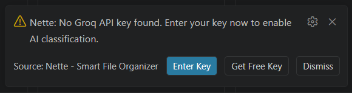
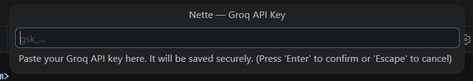

# Nette - Smart File Organizer

> Save a DSA file. It's already sorted. You didn't do anything.


---

## The problem

You're grinding LeetCode or working through a DSA course. Files pile up fast.

```
workspace/
├── solution.py
├── try2.cpp
├── test_again.java
├── 0_basic.py
├── asdf.cpp
└── untitled3.java
```

Six files. Zero organization. Which one has your binary tree? Which one is the sliding window attempt? You have no idea without opening each one.

Renaming as you go sounds fine until you're mid-problem and the last thing you want to do is think about folder structure. So you don't. The mess stays.

## What Nette does

Nette is an automatic file organizer for VS Code. Every time you save a file, it reads the code inside — class names, method names, variable patterns, imports — and moves the file into the right folder. No renaming. No tagging. No setup.

**Before Nette:**
```
workspace/
├── solution.py        ← binary tree? linked list? no idea
├── try2.cpp           ← some graph thing
├── test_again.java    ← dynamic programming attempt
└── asdf.cpp           ← ???
```

**After Nette:**
```
workspace/
├── Trees/
│   └── BinaryTree/
│       └── 0_solution.py
├── Graphs/
│   └── DFS/
│       └── 0_try2.cpp
├── DynamicProgramming/
│   └── Tabulation/
│       └── 0_test_again.java
└── Basic/
    └── 0_asdf.cpp
```

Same files. Automatically sorted. You never touched the file names.

A file called `0_basic.py` containing a `TreeNode` class goes to `Trees/BinaryTree/`. A file called `asdf.cpp` with a `dfs` method and a `visited` array goes to `Graphs/DFS/`. The auto file organizer reads the code, not the name.

## Features
- **Moves files by content, not name** — it doesn't matter what you called the file. Nette reads the code inside it.
- **Handles ambiguous code** — a `Node` class with a `next` pointer goes to LinkedLists. The same class with `left` and `right` goes to Trees. Nette resolves this without asking you.
- **Custom rules** — drop an `organizer.json` file in your workspace to route specific files wherever you want. Your rules always win.
- **Move/skip prompt for uncertain files** — when Nette isn't sure, it shows a two-button prompt: move to its best guess, or skip. No category dropdowns.
- **AI fallback for tricky files** — for files the pattern matcher can't place, Nette can call Groq's free LLM API. Totally optional. Works fine without it.
- **One-click undo** — every move is logged. The status bar shows an undo button after every move. Click it to put the file back instantly.
- **Works on save** — fires automatically when you save. No commands to run.

## How it works
When you save a file, Nette does three things fast:
1. **Read** — it pulls out class names, method names, variable names, imports, and the first few comment lines from your file. Nothing leaves your machine at this step.
2. **Match** — it runs those signals through a library of 53 DSA topic patterns. A file with class `MinHeap` and a `heapify` method scores high on the Heap pattern. A file with `dp[i][j]` and a method called `longestCommonSubsequence` scores high on Dynamic Programming / String DP. The highest scoring pattern wins.
3. **Move** — if the score is confident enough, the file moves silently. If it's borderline, you get a two-button prompt. If nothing matches (like a basic utility file with no DSA patterns), Nette skips it and shows a brief status bar note.

The whole thing runs in under a second for most files.

## Setting up AI (optional)
Nette works without any API key. The pattern matcher handles the vast majority of DSA files on its own.

If you want AI classification for files the matcher can't place, Nette uses Groq — it's free, no credit card required.

To set your key:
The first time Nette encounters a file it can't classify, you'll see a notification:
> Nette: No Groq API key found.
> [Enter Key] [Get Free Key] [Dismiss]



Click **Get Free Key** — your browser opens to `console.groq.com/keys`. Copy your key. VS Code prompts you to paste it:
> Nette — Groq API Key
> Paste your key here... (input is masked)



Your key is stored in your OS keychain via VS Code's secret storage. It never appears in `settings.json` or any file on disk.

You can also set or update the key any time via the Command Palette:
`Ctrl+Shift+P` → **Nette: Set Groq API Key**

## Configuration
Settings are under **File → Preferences → Settings → Nette**.

| Setting | Type | Default | Description |
| :--- | :--- | :--- | :--- |
| `nette.enabled` | boolean | `true` | Turn Nette on or off |
| `nette.rootDir` | string | `"."` | Root folder for organized files, relative to workspace root. Set to "." to place files directly in the workspace |
| `nette.confidenceThreshold` | number | `0.55` | How confident Nette needs to be before moving without asking. Lower = more aggressive, higher = more cautious |
| `nette.aiEnabled` | boolean | `true` | Enable Groq AI fallback for files the pattern matcher can't place |
| `nette.debounceDelay` | number | `900` | Milliseconds to wait after a save before classifying. Increase if files are being processed twice |
| `nette.autoNumber` | boolean | `true` | Prefix moved files with the smallest available number in the destination folder (e.g. 0_solution.py, 1_solution.py) |
| `nette.manualSaveOnly` | boolean | `true` | Only trigger on manual save (Ctrl+S). When on, autosave won't move files |

## organizer.json
Drop this file in your workspace root to define your own routing rules:
```json
{
  "version": 1,
  "rules": [
    {
      "id": "leetcode-solutions",
      "conditions": {
        "classNameContains": "Solution",
        "fileNameContains": "lc"
      },
      "matchMode": "any",
      "target": {
        "topic": "LeetCode",
        "subtopic": "Solutions",
        "folder": "LeetCode/Solutions"
      },
      "priority": 10
    }
  ],
  "learned": []
}
```
Rules run in descending priority order. A matching rule overrides the pattern matcher entirely. The `learned` array is managed automatically — leave it alone.

You can also use `folderMap` to remap Nette's default folder names to your own existing structure:
```json
{
  "version": 1,
  "rules": [],
  "learned": [],
  "folderMap": {
    "Trees/BinaryTree": "My Trees",
    "DynamicProgramming": "DP"
  }
}
```

---

## Supported languages

| Language | Extensions |
|---|---|
| Python | `.py` |
| Java | `.java` |
| C++ | `.cpp`, `.c` |
| TypeScript | `.ts` |
| JavaScript | `.js` |

---

## Folder structure
Folders are created on demand — only the ones you actually use appear on disk. The full set of topics Nette knows about:

- **Trees/** (BinaryTree, BST, Trie, AVLTree, SegmentTree, FenwickTree, SparseTable, NaryTree)
- **LinkedLists/** (Singly, Doubly, FastSlowPointer)
- **Graphs/** (DFS, BFS, TopologicalSort, UnionFind, Dijkstra, BellmanFord, FloydWarshall, MST, Bipartite, SCC, Eulerian)
- **DynamicProgramming/** (Memo, Tabulation, Knapsack, IntervalDP, StringDP, TreeDP, GameTheory)
- **Strings/** (KMP, RabinKarp, ZAlgorithm, Manacher, SuffixStructures, General)
- **Matrix/** (Traversal, Islands, GridDP)
- **Recursion/** (DivideAndConquer, Permutations, Subsets)
- **AdvancedDS/** (MonotonicStack, LRUCache, Deque, OrderedSet)
- **Sorting**
- **Heap**
- **Backtracking**
- **TwoPointers**
- **BinarySearch**
- **Stack**
- **Queue**
- **Hashing**
- **Greedy**
- **BitManipulation**
- **Math**
- **Geometry**

## Privacy
Code snippets sent to Groq have secrets automatically scrubbed before transmission — API keys, tokens, and common credential patterns are replaced with `[REDACTED]`. Your Groq API key is stored in your OS keychain via VS Code's secret storage. It never appears in `settings.json` or any file on disk.

## Contributing

Pull requests are welcome. The classifier is entirely data-driven — adding a new DSA
topic means adding one descriptor object to the `TOPICS` array in
`src/classifier/heuristic.ts`. No logic changes required. Please include at least one
test case in `test/heuristic.test.ts` for any new topic descriptor.

---

## License
MIT © 2026
